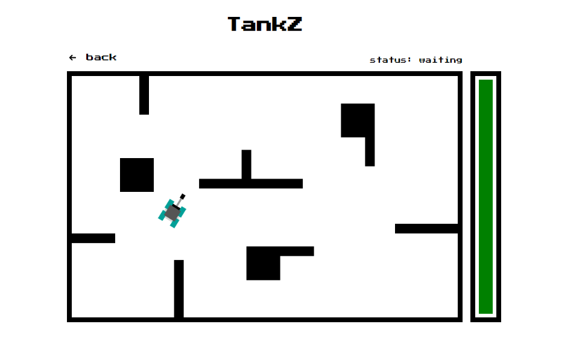

# **:joystick: TankZ**

The retro game of tanks. [Access the demo.][demo]

## :bulb: Objective

This game was developed to be a retro game. It is a monorepo with a frontend in React and a backend in Node.js where i applied some **SOLID** principles.

## :heavy_check_mark: Features

- Login and register
- Creation, searching and joining games
- Real time game engine
- History of games

## :art: Layout

<h1 align="center">
    
</h1>

## **:wrench: Technologies**

- React
- Styled-Components
- Socket.Io
- Yarn Workspaces
- Node.js
- MongoDb
- GraphQL w/ Apollo
- Jest

## :books: How to use

```sh
# Install dependencies

$ yarn


# Start the server

$ yarn workspace server dev


# Start the website

$ yarn workspace web dev


# Server port: 4000
# Web port: 3000
```

## :open_book: How to contribute

1. Make a **fork**.

2. Make a new branch with your changes: `git checkout -b my-feature`

3. Save your changes and make a commit with a cool message: `git commit -m "feat: My new feature"`

4. Send your changes: `git push origin my-feature`

> If a question persists, see [how to contribute in GitHub](https://github.com/firstcontributions/first-contributions)

## :memo: License

This project is under the **MIT License**. See [LICENSE][license] to know more.

---

<h4  align="center">

Made with ❤️ by <a  href="https://www.linkedin.com/in/rikelme-griep-b265a51ab"  target="_blank">Rikelme Griep</a>

</h4>

[license]: https://opensource.org/licenses/MIT
[demo]: https://tankz.vercel.app
